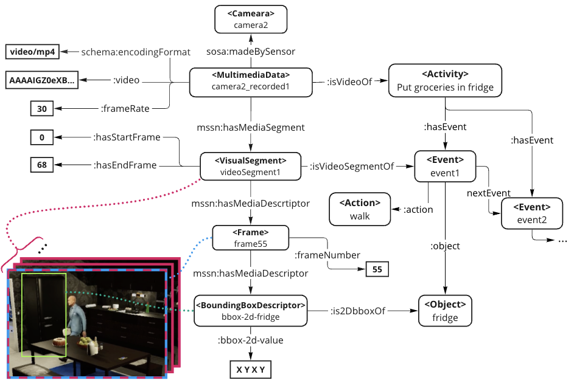

# VHAKG

VHAKG is a multi-modal temporal knowledge graph (MMTKG) of multi-view videos of daily activities.
This repository explains VHAKG and provides sample files.

The full dataset is available on Zenodo.  

## Sample data

- [image_rdf](./example/image_rdf/)/*.ttl
    - MMTKG with video frame image data directly embedded as literal values
- [video_rdf](./example/video_rdf/)/*.ttl
    - MMTKG with video data directly embedded as literal values

## Schema

The KG schema is defined as [OWL file](./vh2kg_schema_v2.0.0.ttl).

## Tools

A set of tools for searching and extracting videos from VHAKG is available.

[https://github.com/aistairc/vhakg-tools](https://github.com/aistairc/vhakg-tools)

## Publications

Shusaku Egami, Takanori Ugai, Swe Nwe Nwe Htun, Ken Fukuda: VHAKG: A Multi-modal Knowledge Graph Based on Synchronized Multi-view Videos of Daily Activities, Proceedings of the 33rd ACM International Conference on Information and Knowledge Management (CIKM2024), pp.5360-5364, 2024 https://doi.org/10.1145/3627673.3679175